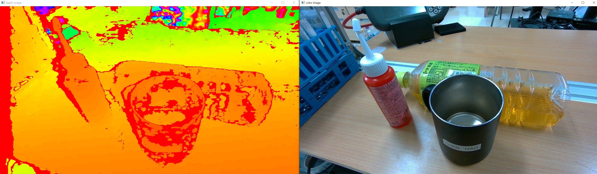
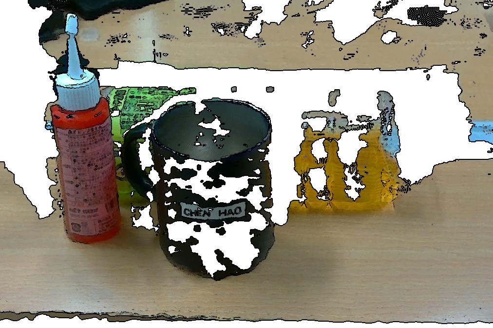

# pyrealsensed405
A example to get data from Realsense D405

## Requirements 
Install python library `pyrealsense2` and `numpy`

## Example
1. Get depth image and color image

2. Get color point cloud

## Reference
RealSense API: https://dev.intelrealsense.com/docs/python2
